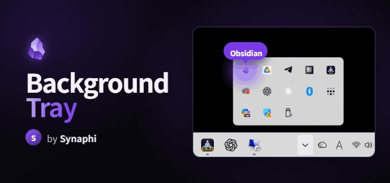

# Still Running

Keep Obsidian running in the system tray instead of quitting when you close the window.

**One job, done well.** Still Running is intentionally tiny and single-purpose — close-to-tray and a tray icon, nothing else. No background services, no extra UI, no bloat. Turn it off and Obsidian behaves exactly as before.

A robust, modern reimplementation of the (now unmaintained) `obsidian-tray`, built for Obsidian / Electron in 2026. Originally forked from Synaphi's `background-tray`.

> Desktop only. Windows and macOS are fully supported. Linux tray behaviour depends on your desktop environment and is best-effort.

## Why keep Obsidian in the tray?

- **Sync keeps working in the background.** Because Obsidian stays running when you close the window, Obsidian Sync (and any other background sync) keeps going on its own instead of pausing until you reopen the app. Close the window, walk away — your vault stays up to date.
- **Instant reopen.** Bringing Obsidian back from the tray is immediate — no cold start, no vault picker.
- **Lightweight.** It just keeps the window alive in the tray; it adds no measurable overhead.

## Features

- **Run in background** — closing the window (X) hides Obsidian to the tray instead of quitting.
- **Tray icon** — left-click toggles show/hide; right-click menu: Show/Hide, New note, Relaunch, Quit completely. Uses Obsidian's own app icon by default.
- **New note from the tray** — creates a note (optionally from a template, in a configured folder) and opens it. Also triggerable over the external toggle socket (see below), so it can be bound to a global keyboard shortcut.
- **Single-instance focus** — relaunching Obsidian while it's hidden in the tray restores the existing window instead of opening the vault switcher. (Toggle in settings.)
- **Quit completely / Relaunch** — from the tray icon's right-click menu.
- **Custom tray icon & tooltip** — `{{vault}}` is replaced with the vault name.
- **External toggle (optional)** — expose Show/Hide over a local socket so an OS-level global keyboard shortcut can bring Obsidian back without touching the mouse.  
  See [below](#show--hide-or-create-a-note-with-a-global-keyboard-shortcut).
- Turning the plugin off restores all default behaviour completely (no leftover listeners).

## Install

**Community store:** Settings → Community plugins → Browse → search **Still Running** → Install → Enable.

**Manual:** copy `main.js`, `manifest.json`, and `styles.css` into
`<vault>/.obsidian/plugins/obsidian-still-running/`, then enable it under
Settings → Community plugins.

**BRAT (beta):** add this repo in the BRAT plugin.

## Usage

Close the window and Obsidian keeps running in the tray — and so does your sync. Click the tray icon to bring it back. To actually quit, right-click the tray icon and choose **Quit completely**.

## Show / hide (or create a note) with a global keyboard shortcut

The tray icon works with a mouse, but the plugin can also expose Show/Hide — and quick note creation — over a local socket (Settings → Still Running → **Enable external toggle**), so either can be bound to an OS-level global hotkey instead. Any tool that can run a shell command on a hotkey works. Connecting to the socket and closing it with no data toggles Show/Hide; sending the text `note` instead creates a new note (see **New note folder** / **New note template** in settings) and shows the window.

### Linux

Requires `socat` (most distros package it; `sudo apt install socat` / `sudo pacman -S socat`).

1. Enable **External toggle** in the plugin settings and copy the socket path shown there.
2. Bind a global shortcut in your desktop environment (e.g. KDE: System Settings → Shortcuts → Custom Shortcuts → New → Global Shortcut → Command/URL) to:
   ```bash
   echo x | socat - UNIX-CONNECT:/path/to/the/socket
   ```
3. Trigger the shortcut — Obsidian shows/hides. For a second shortcut that creates a new note instead:
   ```bash
   echo note | socat - UNIX-CONNECT:/path/to/the/socket
   ```

### macOS

Same idea, using the Unix socket path shown in settings:

```bash
echo x | nc -U /path/to/the/socket      # show/hide
echo note | nc -U /path/to/the/socket   # new note
```

Bind either command to a hotkey with something like [Keyboard Maestro](https://www.keyboardmaestro.com/), [BetterTouchTool](https://folivora.ai/), or `skhd` + a small shell script. macOS has no built-in "run shell command on global hotkey" feature, so a third-party trigger app is required.

### Windows

The plugin listens on a named pipe instead of a Unix socket. From PowerShell:

```powershell
$pipe = New-Object System.IO.Pipes.NamedPipeClientStream(".", "obsidian-still-running-<vault>", [System.IO.Pipes.PipeDirection]::Out)
$pipe.Connect(1000)
$pipe.Dispose()             # show/hide
```

To create a note instead, write `note` before disposing:

```powershell
$pipe = New-Object System.IO.Pipes.NamedPipeClientStream(".", "obsidian-still-running-<vault>", [System.IO.Pipes.PipeDirection]::Out)
$pipe.Connect(1000)
$bytes = [System.Text.Encoding]::UTF8.GetBytes("note")
$pipe.Write($bytes, 0, $bytes.Length)
$pipe.Dispose()
```

Save either as a `.ps1` script and bind it to a global hotkey with a tool like [AutoHotkey](https://www.autohotkey.com/) (`Run, powershell -File "toggle.ps1"`) or the Microsoft PowerToys Keyboard Manager + a shortcut launcher.

## Building

```bash
npm install
npm run dev     # watch build → main.js
npm run build   # typecheck + production bundle
```

## License

MIT. Originally by Synaphi; this fork maintained by [lubdhak7414](https://github.com/lubdhak7414).
